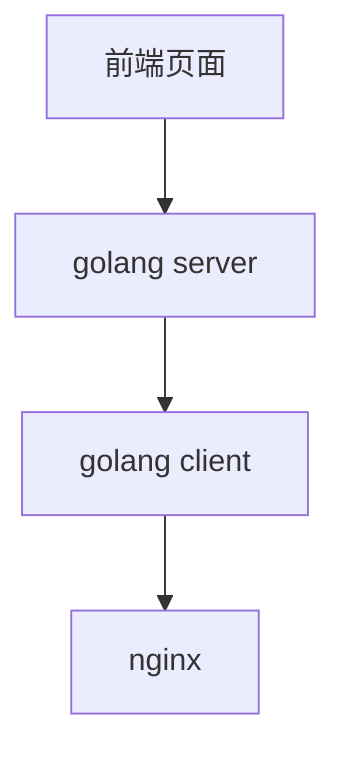
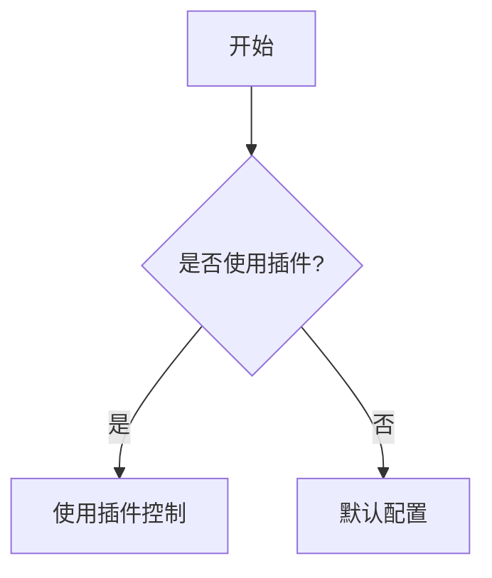
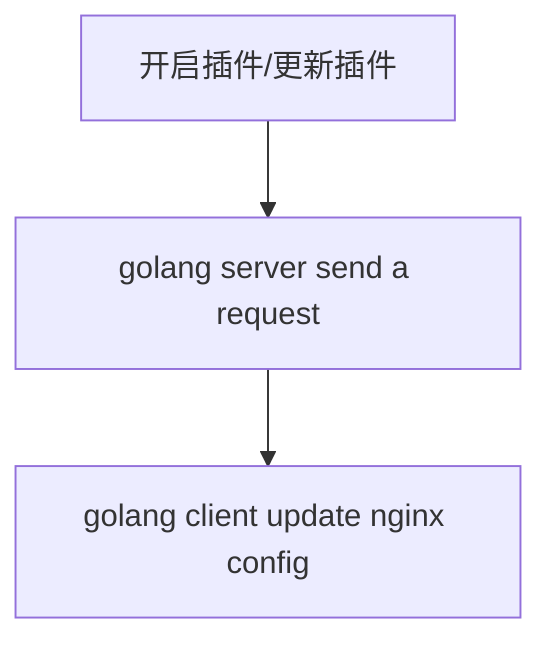

想做一个 nginx 管理平台，以高可拓展性作为战略方向。

由此需要设计一个非常非常灵活的可拓展界面，以及插件系统。

为什么要搞这件事？
- nginx 配置麻烦
- 中小型公司一般就几台或者一台 nginx 处理前后端资源，不易于管理
- 对外可生产环境使用，对内可测试开发使用，通过njs进行拓展(一个小型网关？)

### 目录结构

- 插件市场
- 编写插件模块
- 管理插件模块
- 登录（用户）低优先级

### 表设计

```
每个表都有这几个字段
|created_time|bigint|
|updated_time|bigint|
|deleted_time|bigint|
```

plugin:
|field | type |
|---|---|
| plugin_name| varchar(128) |
| id| bigint |
| author| varchar(128)|

plugin schema config:
|field | type|
|--|--|
|config|text|
|id|bigint|
|config data|text|

后端使用 golang (可以打出来一个可执行包这个诱惑力太大了)
前端使用 react + react jsonschema + mui
数据库暂时使用 sqlite

核心插件：
~~nginx config 插件，用来配置 nginx~~[看来不行，不能执行reload](https://github.com/nginx/njs/issues/10)

架构变化一下

golang client 去做这件事




### 流程

**请求流程**

**配置插件流程**


### 问题
1. 由于njs不能执行sh，所以njs是存在局限性的，可以通过因为golang client解决这个问题，但是存在一个新的问题，如何拓展nginx配置呢？

	对于一些正则过滤实际上不需要njs的，所以需要将已经存在的配置格式化，已经存在的便捷配置不需要进行njs处理，比如请求头标识。
	对于不存在的配置需要njs处理，比如添加水印，注入js
