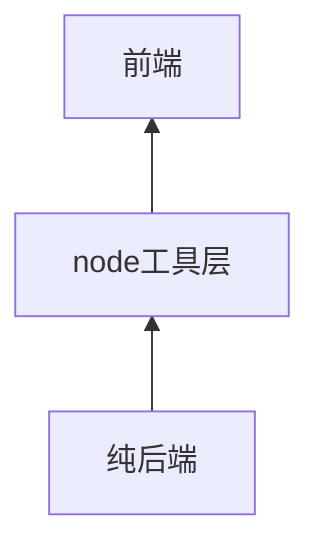
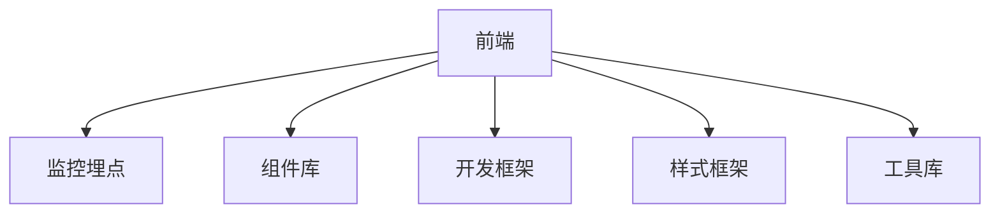
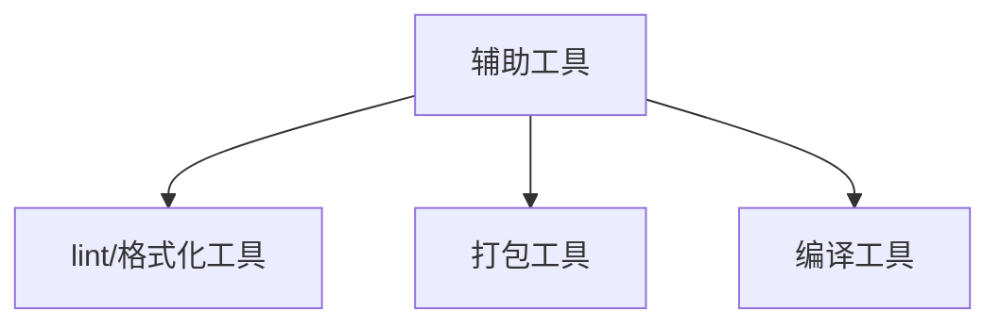
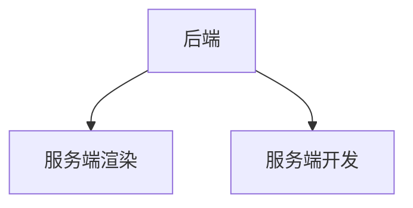

长期更新

更新时间：20220831

从目前看前端大致分为，传统意义的前端，辅助传统意义的前端的工具层，纯后端。

## 前端
前端就是传统意义的界面，这部分包含

- 监控埋点
    - 来说b端可有可无，但是仍需要请求层监控，如果发现问题可以和后端对账
- 组件库
    - 一般都会选个市面开源的，市面上有很多开源组件库比如antd 系列
- 开发框架
    - vue react svelet
    - 响应式，函数式，编译型响应式这几类
    - 如果是涵盖小程序开发，可使用vue的uni app 或者react 的taro
- 样式框架
    - less sass `css in js`
    - 目前看国内less比较多 `css in js`还是蛮少的
- 工具库
    - i18n lodash rxjs bignumber moment/dayjs

## node 工具层

辅助前端开发的工具

- lint/格式化工具
    - eslint prettify
- 打包工具
    - webpack vite 
    - 这些工具大部分开箱即用
- 编译工具
    - esbuild swc babel 

## 纯后端

- 服务端渲染
    - next nuxt remix
- 服务端开发
    - 服务层 nestjs express koa 
    - orm 层 typeorm prisma

## 比较细分前端的类目

- 游戏开发
- 音视频开发
- wasm开发
- 在线文档开发
- 多端开发 

## 总结

总的来讲基本很难在发明颠覆性的东西，但是仍然可以基于已有的思维去增量创新。

